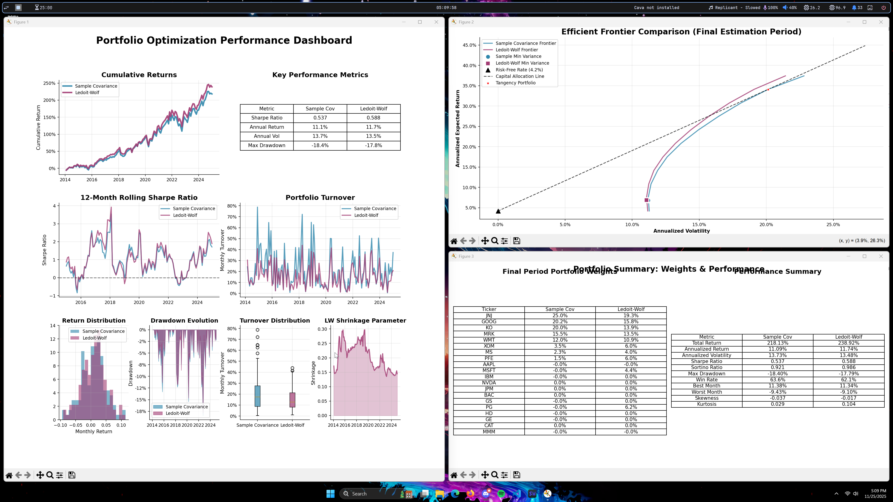

# Minimum Variance Portfolio Optimizer

Portfolio optimization framework implementing mean variance optimization with AI-powered analysis for financial stocks.

## Key Features

Modern Portfolio Theory implementation with minimum variance optimization using CVXPY. Advanced covariance estimation comparing sample vs Ledoit-Wolf shrinkage methods. Rolling window backtesting framework with comprehensive performance metrics. **AI-powered portfolio analysis using LangChain** with support for OpenAI GPT models and local Hugging Face models. Professional visualizations for risk-return analysis and performance dashboards.

## Demo

### Sample Run


### Sample Visualizations



## Tech Stack

**Core:** Python, NumPy, Pandas, CVXPY, Scikit-learn  
**AI/ML:** LangChain, LangChain-OpenAI, LangChain-HuggingFace, Transformers, PyTorch  
**Data:** WRDS/CRSP financial databases  
**Visualization:** Matplotlib, Seaborn

## Installation

```bash
git clone https://github.com/theshahml/minimum-variance-portfolio-optimizer.git
cd minimum-variance-portfolio-optimizer

# Create virtual environment (recommended)
python -m venv .venv
.venv\Scripts\activate  # Windows
# source .venv/bin/activate  # macOS/Linux

# Step 1: Install all dependencies (includes CPU PyTorch)
pip install -r requirements.txt

# Step 2 (OPTIONAL): Upgrade to GPU PyTorch for faster local AI models
pip uninstall torch -y
pip install torch --index-url https://download.pytorch.org/whl/cu130

# Verify GPU is detected
python -c "import torch; print('CUDA available:', torch.cuda.is_available())"
```

## Usage

WRDS account required for live data. OpenAI API key optional for AI-enhanced analysis (local models available as fallback).

**Run the Optimizer:**

```bash
# Interactive optimizer with AI analysis (GPU + CUDA PyTorch highly recommended)
python scripts/ai_enhanced_optimizer.py

# Interactive optimizer (no AI, works on any machine)
python scripts/default_optimizer.py

# Or use the Jupyter notebook
jupyter notebook notebooks/minimum_variance_portfolio_optimizer.ipynb
```

**Note:** For AI-enhanced analysis with local models (Llama 3.2), a GPU with CUDA-enabled PyTorch is highly recommended. Without a GPU, use `default_optimizer.py` for faster execution.

The scripts provide interactive prompts to configure your optimization parameters.

## Project Structure

```
src/
├── portfolio/     # Core optimization modules (optimizer, covariance, metrics)
├── ai/           # LangChain AI analysis (OpenAI, HuggingFace, prompts)
└── utils/        # Visualization & validation utilities

scripts/          # Interactive optimization scripts (main entry points)
notebooks/        # Jupyter notebook for exploration
```

## AI Features

The framework includes AI-powered portfolio analysis with:

- Natural language performance summaries and methodology explanations
- Risk analysis and portfolio composition commentary
- Investment recommendations based on backtest results
- Support for both cloud (OpenAI) and local (HuggingFace) models

## Requirements

- Python 3.8+
- WRDS account (for live data)
- OpenAI API key (optional, for premium AI features)

## Configuration to use AI features

Create a `.env` file in the project root for API keys:

```
OPENAI_API_KEY=your_openai_key_here
```

## Disclaimer

Educational and research purposes only. Not investment advice. Past performance does not guarantee future results.
